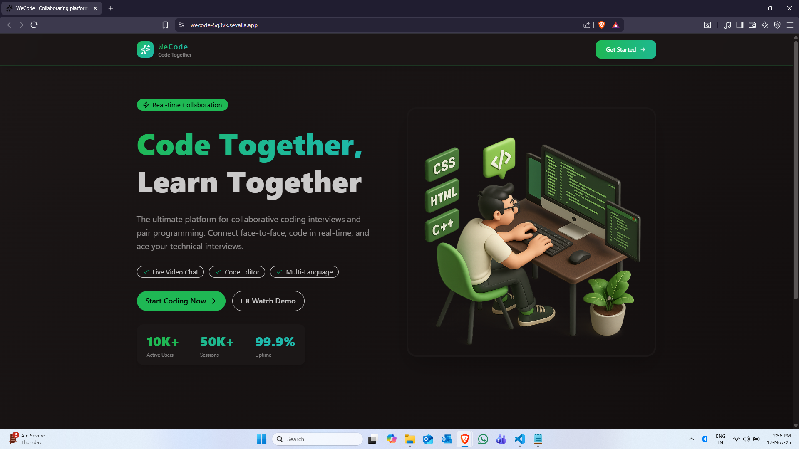

# WeCode — Collaborative Coding Practice

WeCode is a full-stack web application for practicing coding problems with real-time collaborative sessions. It combines an interactive code editor, runnable test harness, and real-time audio/video chat and messaging so two users can pair-program and solve problems together.

<p align="center">
    
    </p>

**What it does**
- Users sign in with Clerk and can create or join live coding sessions.
- Each session provides a shared coding environment (Monaco editor), code execution via the Piston API, a Stream-powered video call, and a Stream chat channel for messaging.
- Sessions are persisted in MongoDB and can be listed as active or retrieved from recent/completed history.
- The backend syncs Clerk user events (user.create / user.delete) into the local DB and into Stream using Inngest background functions.

**Key Features**
- Real-time video calls for pair programming (Stream Video SDK).
- Stream chat channels tied to session rooms for text chat and message history.
- Create / Join / End sessions with host/participant model.
- Persistent session metadata in MongoDB (host, participant, problem, difficulty, status).
- Code execution via the Piston API (multi-language support).
- Authentication & authorization via Clerk (`@clerk/express` on backend, `@clerk/clerk-react` on frontend).
- Background event handling with Inngest for syncing external user events.

**Project Structure**
- `FrontEnd/` — React + Vite frontend. See `FrontEnd/README.md` for detailed docs, env vars, and run steps.
- `BackEnd/` — Express + Node backend. See `BackEnd/README.md` for API docs, env vars, and run steps.

**Tech Stack / Tools**
- Frontend: React, Vite, TailwindCSS, Monaco Editor, Stream Video SDK, Stream Chat, Clerk, React Router, React Query
- Backend: Node.js, Express, Mongoose (MongoDB), Stream Chat & Stream Node SDK (video), Clerk, Inngest, dotenv
- Dev tools: nodemon (backend), Vite (frontend)

**Quickstart (development)**
1. Start the backend

```powershell
cd BackEnd
npm install
# create a .env file with values (see BackEnd/README.md)
npm run dev
```

2. Start the frontend

```powershell
cd FrontEnd
npm install
# create a .env (Vite) with VITE_API_URL and VITE_STREAM_API_KEY
npm run dev
```

Open the browser at the URL shown by Vite (usually `http://localhost:5173`) and sign in using the configured Clerk provider.

**Where to look next**
- Backend API documentation and environment variables: `BackEnd/README.md`
- Frontend usage, component list and env variables: `FrontEnd/README.md`

## Connect With Me
- **LinkedIn:** https://www.linkedin.com/in/devadi 
- **GitHub:** https://github.com/ADI-2707